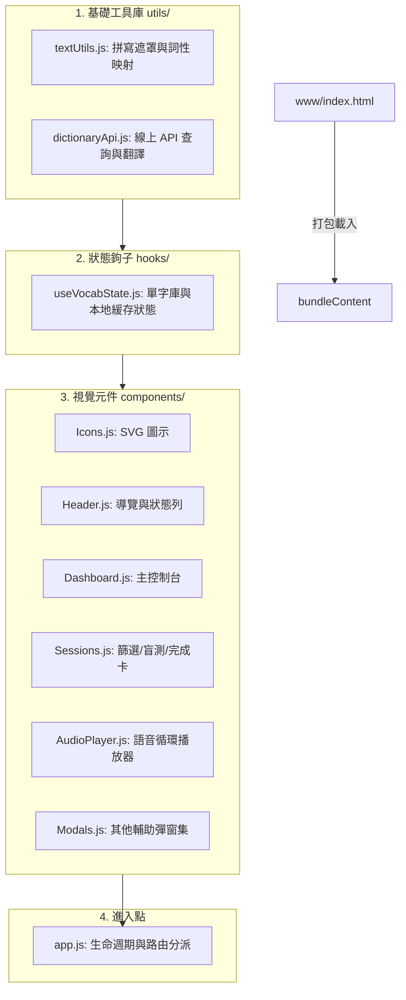

# 📖 VocabTool-App 技術開發手冊 & 新功能指引

本手冊旨在完整記錄 `VocabTool-App v1.5.0` 的模組化架構設計、核心機制、打包限制以及未來開發與擴充的規範。方便開發者與後續的 AI 協作 Agent 快速上手。

---

## 1. 專案模組架構 (Clean Modular Architecture)

為了解決單一檔案過於龐大且不易維護的問題，本專案已將核心邏輯、狀態管理與 UI 元件進行了解耦。其結構如下：



---

## 2. 核心功能設計要點

### 💾 本地優先與手動資料管理
- 本系統完全轉為純本地 (Local-first) 模式運作，無任何外部同步網路開銷或 API 相依性。
- 提供主控制台中的 **「⬇️ J (系統完整 JSON 備份)」** 手動匯出下載與 **「⬆️ J」** 匯入還原，保障使用者資料安全。

### 🎧 聽讀特訓與盲聽系統 (`AudioPlayer.js`)
- **拼寫語音播放**：播放語音時，系統朗讀字母拼寫 (`"a, p, p, l, e"`)，單字保持穩定靜態暗黑質感呈現，徹底避免字母跳動與閃爍。
- **盲聽模式 (Blind Mode)**：在此模式下，未播放到的英文單字、中文釋義和例句都會被以圓點 `•` 遮蔽，直到對應部分的音軌被唸出為止。
- **防止螢幕休眠**：聽音特訓期間會自動啟用 Wake Lock API 鎖定螢幕亮度，避免背景播放時設備自動休眠，在停止播放時釋放鎖定。

### ✍️ 高壓填空盲測與手滑警告 (`Sessions.js`)
- **手滑警告機制**：用戶拼錯一次時，觸發 typo 狀態 (`typoCount === 1`)，給予警告提示。
- **強迫複製重抄**：若拼錯第二次則判定為失憶，系統強制開啟手抄面板。用戶必須對照正確答案，在輸入框內手動輸入完全一致的單字，方可繼續下一個單字。

---

## 3. 重要開發鐵律與環境限制

> [!CAUTION]
> ### 🔒 Android WebView CORS 限制 (極重要)
> 本專案為 Capacitor Android 原生 App。Android 系統的 WebView 採用 `file://` 協議加載本地 HTML，這會觸發瀏覽器最嚴格的 CORS 跨網域與跨檔案安全性限制，導致瀏覽器拒絕動態載入外部 JSX/JS 模組檔案。
> 
> **解決方案**：
> - **一律禁止**在 HTML 中使用 `<script type="module">` 載入本機多個模組檔案。
> - 開發時在 `www/js/` 修改模組程式碼。
> - 在發布或跑測試前，必須執行 `npm run build` 打包腳本。

### 🎨 UI 0 變化原則
進行任何架構重構或元件調整時，必須確保原本的 Tailwind CSS 樣式、動畫、按鈕顏色與手機版排版 `105%` 零偏離。

---

## 4. 常用開發與打包指令

在專案根目錄下，開啟終端機執行以下指令：

```bash
# 1. 預編譯打包所有 JS 模組合併至 www/index.html (由 scripts/build.js 執行)
npm.cmd run build

# 2. 將 www/ 下的 Web 資源同步至 Android 原生專案目錄
npx cap sync android

# 3. 在原生目錄下編譯 Debug APK
.\gradlew.bat -p android assembleDebug
```

---

## 5. 後續 AI 協作 Agent 指南

如果您是下一位接力開發的 AI 助手，在開始工作前請注意：
1. **先讀取本指南**，熟悉模組結構與打包流程。
2. **絕不自動 Push**：未經使用者明確口頭同意，絕對不能執行 `git push` 命令。
3. **新增元件時**：
   - 需在 `www/js/components/` 底下建立獨立元件，並掛載至 `window`（例如 `window.NewComponent = ...`），以便打包時能被全域識別。
   - 務必將新檔案的路徑加入 `scripts/build.js` 的 `files` 陣列中，放置在 `app.js` 之前。
   - 執行 `npm.cmd run build` 更新 `www/index.html`。
