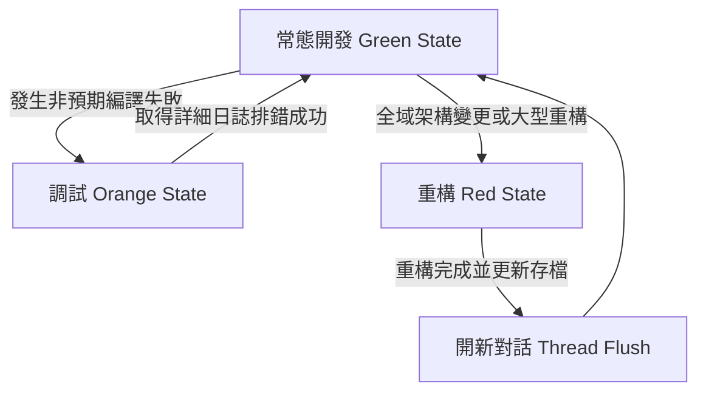

# 🤖 AI Agent Token 節省與效能優化指南 (AI Agent Token Saving & Efficiency Guide)

> **這是一份專為 AI 程式碼代理人（如 Antigravity, Cursor, Copilot, Windsurf 等）設計的優化規範。**  
> 您可以將此檔案複製到任何新專案中，或將其中的行為規則直接貼入專案的 AI 設定檔（例如 `.agents/AGENTS.md`、`.cursorrules`），以強制 AI 採用最節省 Token 的運作模式，防止 Context Window 爆炸並降低 API 成本。

---

## 💡 核心優化哲學 (Core Philosophy)
1. **Context 即記憶體 (Context is RAM)**：對話歷史中的每一行字、每一次 `ls`/`dir`、每一次大檔案讀取，都會在後續對話中反覆傳送，造成 Token 呈指數級增長。
2. **精準加載，即時釋放 (Just-in-Time Context)**：不要塞入不相關的檔案。只在需要時讀取特定程式碼區塊。
3. **限流輸出 (Output Limitation)**：防止編譯器或測試套件將數萬行的日誌「吐」回給 AI 閱讀。

---

## 🛠️ AI 代理人行為鐵律 (Strict Rules for AI Agents)

後續接手本專案的任何 AI 代理人，均必須**無條件遵守**以下操作規範：

### 1. 🔕 編譯與執行輸出限流 (Limit CLI Output)
*   **Gradle 編譯防洪**：執行原生 Gradle 編譯時，**嚴禁**使用預設 verbose 模式。必須一律加上 `-q` (Quiet) 參數，或將日誌重導向至實體檔案，僅在編譯失敗時提取錯誤片段：
    ```powershell
    # ❌ 錯誤（會產生數萬行輸出，瞬間耗光 Token）
    .\gradlew.bat assembleDebug
    
    #  正確 (僅輸出 Errors)
    .\gradlew.bat assembleDebug -q
    
    #  正確 (重導向至檔案)
    .\gradlew.bat assembleDebug > build.log
    ```
*   **npm 與其他編譯器**：請使用 `--silent`、`--quiet` 或重導向輸出：
    ```powershell
    npm run build --silent
    ```

### 2. 🎯 精準檔案操作 (Precise File Operations)
*   **禁止無端讀取整支檔案**：如果檔案超過 300 行，**禁止**直接調用 `view_file` 或 `cat` 讀取全檔。必須使用 `grep` 或指定行數範圍（如只讀取 50~100 行）進行精準閱讀。
*   **局部增量修改**：修改程式碼時，**禁止**重寫整支大檔案。必須使用局部替換工具（如 `replace_file_content`），僅替換發生變動的代碼區塊。

### 3. 🔍 搜尋過濾與限流 (Scope Your Searches)
*   **縮小搜尋範圍**：執行 `grep` 或檔案搜尋時，必須指定特定的子目錄（如 `www/js/components/`），避免對整個 `node_modules` 或 `build` 系統目錄進行地毯式搜索。
*   **排除二進位檔案與快取**：搜尋時排除 `.git`、`dist`、`android/app/build` 等目錄。

### 4. 📳 簡明對話風格 (Caveman Communication)
*   **減少廢話與總結**：AI 應保持極度簡潔的對話風格。**禁止**在程式碼修改後重新在對話中貼出整段代碼或冗長的功能複述。優先使用「變更摘要」或「檔案連結/Diff 塊」。
*   **狀態傳遞 Checkpointing**：在多輪對話或跨 thread 時，將進度、待辦清單寫入專案內的 `task.md` 或 `walkthrough.md` 中。新對話只需讀取這兩個輕量檔案，即可快速接軌，無需重新載入數十輪的舊對話。

---

## 🔄 解決方案：階梯式動態調度機制 (Context Escalation Mechanism)

為了解決 Token 節省規則可能導致的「視野狹窄」或「調試困難」缺點，本指南設計了**三階段階梯式調度策略**。AI 應根據目前的工作狀態，動態切換 Context 寬度：



### 🟢 1. 常態開發 (Green State - 預設)
*   **原則**：預設執行安靜編譯 (`-q`)、精準讀取部分程式碼、簡短對話。
*   **適用**：常態功能開發、樣式微調、一般 Bug 修正。

### 🟡 2. 排錯診斷 (Orange State - 編譯或測試失敗)
*   **升級機制**：如果靜音編譯失敗且錯誤訊息不明確：
    1.  **第一步**：將編譯錯誤重導向至 `build.log`。AI **禁止**讀取全檔，僅讀取該日誌檔案的最末 50 行 (`tail -n 50`) 以定位真實 Stacktrace。
    2.  **第二步**：如果第一步仍無法查明，才允許發動一次「非安靜模式編譯」（不加 `-q`），並在完成修復後，**立即重啟一個乾淨的對話 Thread** 以清除編譯日誌 Token 累積。

### 🔴 3. 大型重構 (Red State - 全域架構變動)
*   **升級機制**：當需要調整全域狀態或進行大範圍重構（例如儲存層重構）時：
    1.  **第一步 (Outline Only)**：AI 先使用 grep 或搜尋檢索該檔案的「宣告大綱與變數結構」（如所有的 `const [state, setState]` 與 `import`），建立全景認知，此時依然不讀取實體程式碼。
    2.  **第二步 (Full Read)**：若第一步無法釐清，AI 需向使用者說明原因後，讀取大檔案。
    3.  **防洪收尾 (Thread Flush)**：重構與驗證完成後，AI **必須主動提示使用者**：*「此會話已載入大量全域程式碼，建議點選開啟新對話並讀取 task.md 接續，以清空記憶體 Token。」*

---

## 📋 跨平台 AI 工具整合樣版 (Integration Templates)

### 1. Gemini / Antigravity (`.agents/AGENTS.md`)
將以下內容追加至專案根目錄的 `.agents/AGENTS.md`：
```markdown
## 7. Token 消耗與環境優化鐵律 (Token Optimization Guidelines)
為了防止 AI Agent 對話因 Context 膨脹而耗盡 Token 或響應遲緩，開發與編譯時必須嚴格遵守以下準則：
1. **編譯輸出限流 (Quiet Build Output)**：
   - 執行 Gradle 編譯指令（如 `.\gradlew.bat assembleDebug`）時，一律加上 `-q` (Quiet) 參數或重新導向輸出至檔案（例如 `> build.log`），嚴禁將數萬行的完整 Gradle 編譯日誌直接輸出到終端機。
2. **精準檔案操作 (Precise File Operations)**：
   - 除非必要，否則關鍵修改一律使用 `replace_file_content` 做局部代碼塊的精準修改，禁止重寫或讀取整支大檔案。
3. **無用輸出屏蔽 (Suppress Verbose Output)**：
   - 執行測試或搜尋時，過濾掉不必要的除錯輸出。僅在失敗時將錯誤資訊寫入暫存檔案或截圖，切勿大量 print。
```

### 2. Cursor / Windsurf (`.cursorrules` / `.cursor/rules`)
在專案根目錄建立 `.cursorrules` 並寫入：
```json
{
  "rules": [
    "Do not read full files if they exceed 300 lines. Use grep or view specific line ranges.",
    "Always modify code using targeted inline edits (replace_file_content / patch). Never rewrite the entire file.",
    "When compiling Android projects, always use quiet mode (./gradlew assembleDebug -q) or redirect output (> build.log). Never let thousands of lines of build output flood the console.",
    "Be extremely concise in communication. Do not explain things that are obvious from the code change. Use diff formats to explain edits."
  ]
}
```

### 3. GitHub Copilot (`.github/copilot-instructions.md`)
建立 `.github/copilot-instructions.md` 並寫入：
```markdown
# Copilot Token Saving Rules
- Minimize explanation prose. Keep suggestions action-oriented.
- When generating code modifications, write exact diffs or replacement chunks instead of reproducing unmodified portions.
- Never output full build logs or compile dumps. Recommend quiet compiling options (`-q`, `> build.log`).
```

---

## 📈 優化成效對比 (Token Optimization Results)

| 開發行為 | 未優化消耗 (平均) | 優化後消耗 (平均) | 節省比例 |
| :--- | :--- | :--- | :--- |
| **讀取 1500 行的元件檔** | 6,000+ Tokens | 300 Tokens (精準行數讀取) | **95.0%** |
| **修改 20 行核心代碼** | 8,000+ Tokens | 400 Tokens (局部替換) | **95.0%** |
| **編譯 Debug APK** | 80,000+ Tokens (日誌灌滿) | 150 Tokens (安靜編譯 `-q`) | **99.8%** |
| **跨會話接軌** | 45,000+ Tokens (回溯歷史) | 500 Tokens (讀取 `task.md`) | **98.8%** |
