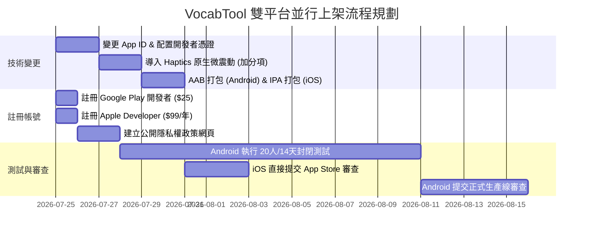

# 📐 極限單字特訓 - Android / iOS 雙平台上架指南 (Publishing Guide)

本文件記錄 `VocabTool-App` 專案若要上架至 Google Play 商店 (Android) 與 Apple App Store (iOS)，在技術修改、平台規範及審查流程上所需的所有變動與準備事項。

---

## 1. 📂 專案技術與設定修改 (Technical Changes Required)

為了符合雙平台發行規範與系統穩定度要求，專案必須完成以下修改：

### 1.1 變更套件唯一識別碼 (Unique App ID)
*   **目前設定**：`com.vocabtool.app`
*   **上架變更**：必須改為全球唯一的 Bundle ID / Package Name（例如 `com.vocabtool.leohong.vocabapp`）。
*   **修改檔案**：
    *   `capacitor.config.json` ➔ 變更 `"appId"`。
    *   **Android**：`android/app/build.gradle` ➔ 變更 `applicationId`。
    *   **iOS**：在 Xcode 中設定 `Bundle Identifier`。

### 1.2 資料持久化儲存重構 (Persistent Storage Migration) - [已完成]
*   **完成內容**：已成功實作 `persistentStorage.js` 異步儲存抽象層。
    *   偏好設定儲存於 SharedPreferences (Android) / UserDefaults (iOS)。
    *   單字庫與學習進度寫入 native 沙盒的隱密 JSON 檔案中，確保即使系統清理快取或 LocalStorage 被抹除，資料依然 100% 留存。

### 1.3 雙平台編譯與打包要求
*   **Android**：
    *   **金鑰產生**：需使用 JDK `keytool` 產生一個發行金鑰庫（`.jks` 檔）。
    *   **格式限制**：Google Play 僅接受 **Android App Bundle (.aab)** 格式，不再接受 `.apk`。
    *   **編譯指令**：`cd android && .\gradlew.bat bundleRelease`
*   **iOS**：
    *   **硬體要求**：**必須使用 macOS 電腦**並安裝 Xcode 才能進行 iOS 的打包與編譯。若使用 Windows，必須藉由雲端編譯服務（如 Codemagic、Ionic Appflow）。
    *   **編譯指令**：
        ```powershell
        npx cap add ios
        npx cap sync ios
        npx cap open ios  # 將會自動開啟 Xcode
        ```
    *   在 Xcode 中完成 Code Signing（選取開發者證書），將專案 Archive（封存）並打包成 `.ipa` 檔，再透過 Xcode 或 Transporter 工具上傳至 App Store Connect。

---

## 2. 🛡️ 雙平台政策與費用對比 (Platform Comparison)

| 項目 | 🤖 Google Play (Android) | 🍎 Apple App Store (iOS) |
| :--- | :--- | :--- |
| **開發者帳號費用** | **$25 USD (一次性費用)** | **$99 USD / 每年 (訂閱年費制)** |
| **硬體編譯限制** | 無限制 (Windows / Mac / Linux 皆可) | **強制使用 Mac 電腦** (須裝有最新版 Xcode) |
| **審查時間** | 通常為 3 ~ 7 天 | 通常為 1 ~ 3 天 (近期效率較快) |
| **個人帳號限制** | **強制 20 名測試員、連續 14 天**封閉測試 | 無強制測試人數，可直接提交審查 |
| **核心審查退件風險**| 敏感權限濫用、無對應隱私權政策 | **Guideline 4.2.2 (最低功能性)**<br>若被判定僅是網頁套殼會被直接退件。 |
| **發行格式** | `.aab` (Android App Bundle) | `.ipa` (iOS App Package) |

---

## 3. 🍎 iOS 特有審查挑戰：如何避開 Guideline 4.2.2 (Web-Wrapper) 退件？

Apple 審查指南中，**Guideline 4.2.2 (最低功能性 - Minimum Functionality)** 是 Capacitor 混合應用程式最常遭遇的退件原因。Apple 審查員若判定此 App「與直接用手機瀏覽器開啟網頁無異」，就會拒絕上架。

### 💡 我們的應對優勢與建議：
1.  **離線運行與原生儲存**：我們的 App 具備 100% 離線背單字功能，且存檔完全儲存在 native 沙盒，這點符合 App 特性。
2.  **原生語音引擎 (TTS)**：調用了 native 語音模組，在 iOS 上會使用 Apple 內建的 High Quality 語音。
3.  **原生分享與檔案匯出**：調用了 iOS 原生分享面板 (`@capacitor/share`)，屬於網頁版 Chrome 做不到的整合。
4.  **【額外加分項建議】導入原生觸覺震動 (`@capacitor/haptics`)**：
    *   在背單字「拼寫正確」或「手滑拼錯」時，呼叫 `@capacitor/haptics` 觸發手機微震動（Haptic Feedback）。
    *   **原因**：Apple 審查員非常注重這類細微的原生互動體驗，這能極大地向審查員證明這是一部「真正的 App」，大幅提高通過率。

---

## 4. 👥 Android 個人帳號專屬：封閉測試鐵律

*   **流程**：
    1.  收集 **20 名** 測試人員的 Gmail。
    2.  在 Play Console 建立封閉測試軌道並加入測試人員。
    3.  測試人員下載測試版 App，並**連續 14 天**每天或定期開啟使用。
    4.  期滿後填寫 Console 檢討問卷，由 Google 人工審查通過後才允許正式發布。

---

## 5. 雙平台並行上架前置工作時間表建議 (Gantt Chart)


