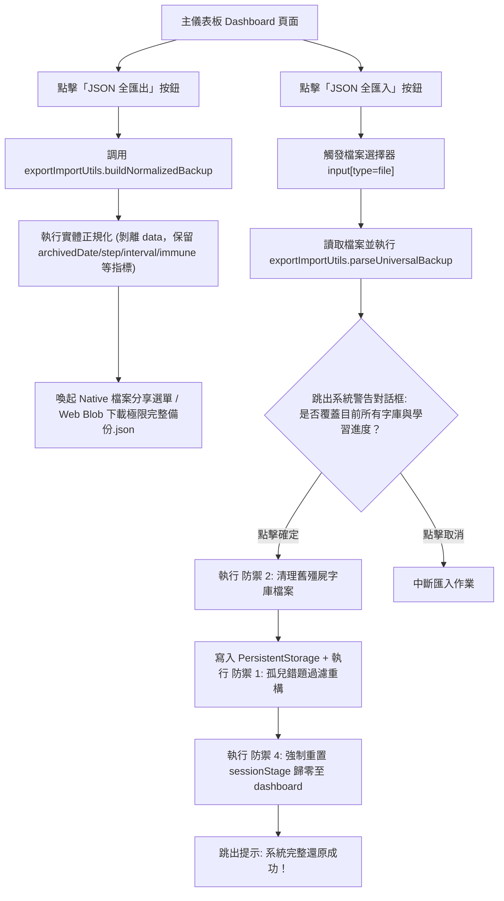

# 🧠 極限單字特訓系統 Mobile App - 產品規格書 (Product Specification)

*   **文件版本 (Document Version)**：1.8.1
*   **適用專案 (Target Project)**：`VocabTool-App` (Capacitor Android + React 18 Mobile Version) & `VocabTool` (Web Version)

本規格書詳細紀錄「極限單字特訓系統 Mobile App」的系統架構、核心演算法、資料儲存結構、正規化備份規格、5 大防禦機制、特訓功能模組、UI 流程規範、開發者建置指令與 OTA 熱更新流程。

---

## 1. 系統架構 (System Architecture)

*   **部署與打包型態**：
    *   **Mobile App**：基於 **Capacitor 7** 的 Android 原生應用程式（包含 `android/` 工程目錄與 `app-debug.apk` / `VocabTool.apk`）。
    *   **Web App**：離線 Single Page Application (SPA)，所有網頁靜態資源置於 `www/` 目錄中，預編譯發布檔為 `www/index.html`。
*   **前端依賴與技術棧**：
    *   **React 18**：負責模組化 UI 渲染與狀態管理。
    *   **Tailwind CSS**：負責介面樣式排版（Glassmorphism 玻璃質感、極深色科技暗黑風格）。
    *   **Babel (Standalone)**：瀏覽器端即時轉譯與發布前預編譯。
*   **資料儲存與備份 (Data & Backup)**：
    *   **混合原生持久儲存**：所有的偏好設定使用 `@capacitor/preferences` 儲存，大型字庫與學習進度使用 `@capacitor/filesystem` 寫入 Android/iOS 原生沙盒之 JSON 實體檔案中，保證資料永不因 OS 清理快取而丟失。
    *   **網頁 Fallback 機制**：在 Web 瀏覽器環境中，自動 Promise 封裝降級使用瀏覽器的 `localStorage`，保證雙平台架構完全相容。
    *   **手動 JSON/TXT 備份還原**：提供手動下載 `極限完整備份.json` (v3.0 正規化格式) 與 `字典/歷史殿堂.txt` 檔案，方便使用者手動進行資料移轉與備份，100% 離線可用。

---

## 2. 資料庫設計與結構 (Database Design & Schemas)

### 2.1 本地儲存與原生沙盒檔案定義
*   **Preferences 偏好設定 (原生 SharedPreferences/NSUserDefaults 或 Web LocalStorage)**：
    *   `vocab_currentDB`：當前選擇的單字庫名稱（預設為 `vocab_2000`）。
    *   `vocab_dbList`：字庫名稱列表（預設包含 `vocab_2000`, `vocab_7000`）。
    *   `vocab_speechRate`：朗讀語速（預設為 `0.8`）。
    *   `vocab_speechEnabled`：發音開關（預設為 `true`）。
    *   `vocab_scanMode`：全域特訓模式（預設為 `'random'`, 可切換為 `'flashcard'` 或 `'mcq'`）。
    *   `vocab_audioSettings`：聽寫朗讀參數設定。
*   **Filesystem 原生沙盒檔案 (原生沙盒 Directory.Data 下之實體 JSON 檔，或 Web LocalStorage)**：
    *   `vocab_data_{dbName}.json` (Web 為 `vocab_customVocab_{dbName}`)：存放字庫的單字陣列 (`Word[]`)。
    *   `vocab_state_{dbName}.json` (Web 為 `vocab_state_{dbName}`)：存放字庫的特訓進度天數、錯題本與歷史殿堂數據 (`DBState`)。

### 2.2 單字資料結構 (`Word`)
```typescript
interface Word {
  en: string;       // 英文單字 (去前後空格，保持正確大小寫)
  pos: string;      // 詞性 (如 n., v., adj., adv., prep., idiom 等)
  zh: string;       // 中文釋義
  eg?: string;      // 例句與翻譯提示，格式如 "English sentence. (中文翻譯。)"
}
```

### 2.3 學習狀態與錯題資料結構 (`DBState`)
採用 **實體數據正規化 (Entity Normalization)** 設計：錯題集 (`mistakes`) 與歷史殿堂 (`historicalMistakes`) 僅以英文 Key (`en`) 為索引，存放特訓與突襲冷卻狀態指標，離隊並剝離重複的 `data: Word` 實體物件，UI 渲染時動態關聯 `vocabList`：

```typescript
interface ActiveMistakeEntry {
  mistakesCount: number;                 // 當日 / 當前循環失誤次數
  correctCount: number;                  // 當前連續拼對次數
}

interface HistoricalMistakeEntry {
  mistakesCount: number;                 // 當次特訓失誤次數
  totalFails: number;                    // 魔王等級 / 累計總失誤次數
  archivedDate: number;                  // 歸檔時間戳記 (Epoch MS)
  step: number;                          // 間隔階段號 (0: 7天, 1: 21天, 2: 60天, 3: 180天)
  interval: number;                      // 當前冷卻天數 (7 / 21 / 60 / 180)
  immune: boolean;                       // 是否通過 180 天抽查達到永久免疫 (true/false)
}

interface DBState {
  currentDay: number;                                // 目前特訓天數 (第 1 天起算)
  learnedWords: string[];                            // 已完成學習的英文單字列表 (以英文 Key 為元素)
  mistakes: Record<string, ActiveMistakeEntry>;      // 當前錯題集中營 (Key 為單字 en)
  historicalMistakes: Record<string, HistoricalMistakeEntry>; // 歷史殿堂數據 (Key 為單字 en)
  streak: {
    count: number;                                   // 連續打卡天數
    lastDate: string | null;                         // 上次打卡日期 (YYYY-MM-DD)
  }
}
```

---

## 3. Web 正規化極致輕量備份規格 (Normalized Backup System v3.0)

### 3.1 JSON 備份檔規格結構 (Version 3.0)
系統匯出之 `極限完整備份_YYYYMMDD_HHMMSS.json` 遵循 v3.0 正規化備份規範：

```json
{
  "version": "3.0",
  "backupType": "normalized_system",
  "exportDate": "2026-07-29T23:20:00.000Z",
  "globalSettings": {
    "currentDB": "vocab_2000",
    "dbList": ["vocab_2000", "vocab_7000"],
    "speechRate": 0.8,
    "speechEnabled": true
  },
  "databases": {
    "vocab_2000": {
      "settings": {
        "wordsPerDay": 50,
        "ghostsPerDay": 10
      },
      "vocabList": [
        { "en": "apple", "zh": "蘋果", "pos": "n.", "eg": "An apple a day." }
      ],
      "state": {
        "currentDay": 23,
        "learnedWords": ["apple", "banana"],
        "mistakes": {
          "apple": { "mistakesCount": 2, "correctCount": 1 }
        },
        "historicalMistakes": {
          "apple": {
            "mistakesCount": 1,
            "totalFails": 1,
            "archivedDate": 1784523606417,
            "step": 0,
            "interval": 7,
            "immune": false
          }
        },
        "streak": { "count": 5, "lastDate": "2026-07-29" }
      }
    }
  }
}
```

### 3.2 5 大邊界防禦與解析適配機制 (5 Edge-Case Protections)

1. **防禦 1: 方案 A 孤兒錯題自動過濾與清掃 (Orphaned Mistake Purge)**
   * **原理**：匯入還原時 (`rehydrateMistakes`)，若錯題單字 `en` 已不在 `vocabList` 中（例如使用者自字典刪除了該字），系統自動跳過過濾（清理孤兒錯題）。
   * **效益**：確保「歷史殿堂」與「幽靈單字特訓」100% 只出現現存有意義的真實單字，防止無譯義空殼字滲透進特訓關卡。
2. **防禦 2: 殭屍字庫檔案與設定清理 (Zombie DB Cleanup)**
   * **原理**：還原全系統備份時，自動比較本機舊 `dbList` 與備份新 `dbList`，呼叫 `deleteDatabaseFiles` 與 `removeSetting` 清掃不在清單中的舊 Persistence 實體檔案與設定。
3. **防禦 3: 內建字庫空陣列降級 (Built-in Asset Fallback)**
   * **原理**：當匯入備份檔中 `vocab_2000` / `vocab_7000` 的 `vocabList` 為空時，自動降級載入 App 內建的原始 `rawVocab` / `rawVocab7000`。
4. **防禦 4: 特訓關卡進行中安全重置 (Active Session Safety)**
   * **原理**：還原成功後，強制重置 `setSessionStage('dashboard')`（回到主儀表板），防止使用者在特訓關卡中途觸發還原時因題目索引溢位導致 Crash。
5. **防禦 5: Android WebView 布林型態安全 (Strict Boolean Type Safety)**
   * **原理**：針對偏好設定 (`speechEnabled`) 實施嚴格布林解析 `(val === true || val === 'true')`，防範 Android WebView 文字 `"false"` 被 JS 誤判為 Truthy 的原生坑洞。

---

## 4. UI 介面與備份/還原流轉 (UI Flow & Backup Interactions)



---

## 5. 特訓流水線與全域特訓模式 (Training Pipeline & Modes)

### 5.1 全域特訓模式定義 (`scanMode`)
位於主儀表板「📢 自動發音」下方，提供 `[ 🎴 閃卡模式 | 🎲 隨機模式 | 🔘 4選1模式 ]` 全域膠囊切換鈕：

*   **`🎴 閃卡模式`**：
    *   **⚡ 今日特訓**：第一關為閃卡瀏覽（認識／不熟）➔ 第二關為強制盲測全拼寫。
    *   **🔥 錯題大會考**：直接進行純拼寫盲測（100% 原始拼字測驗）。
    *   **🏛️ 歷史隨機抽查**：直接進行純拼寫盲測（100% 原始拼字抽驗）。
*   **`🎲 隨機模式`（預設）**：每道題獨立隨機決定題型，50% 機率為四選一 MCQ，50% 機率為拼寫盲測。
    *   **⚡ 今日特訓**：第一關為閃卡瀏覽（認識／不熟）➔ 第二關每字隨機 50% 為四選一 MCQ 或拼寫盲測。
    *   **🔥 錯題大會考**：每字隨機 50% 為四選一或拼寫（兩種題型混合出現）。
    *   **🏛️ 歷史隨機抽查**：每字隨機 50% 為四選一或拼寫（兩種題型混合出現）。
*   **`🔘 4選1模式`**：
    *   **⚡ 今日特訓**：第一關為閃卡瀏覽（認識／不熟）➔ 第二關轉為「四選一選擇題測驗」。
    *   **🔥 錯題大會考**：轉為「四選一選擇題測驗」（答錯視同拼錯重寫，併入錯題集中營懲罰）。
    *   **🏛️ 歷史隨機抽查**：轉為「四選一選擇題測驗」（答錯視同拼錯，退回錯題集中營）。

**隨機模式實作細節**：
*   每字入佇列時，系統就將 `_randomIsSpelling: Math.random() < 0.5` 寫入該 word 物件。
*   `_randomIsSpelling === true` ➔ 該字顯示 `spelling` 拼寫盲測視圖。
*   `_randomIsSpelling === false` ➔ 該字顯示 `scanning` 四選一 MCQ 視圖。
*   換題時（`proceedToNext` / `handleScan`）自動根據下一字的標記切換 `setView`，每字独立評定。

### 5.2 4 選 1 選擇題模式細節 (MCQ Mode Specifications)
*   **選項標籤與鍵盤快捷鍵**：選項按鈕與鍵盤快捷鍵**嚴格使用 `1, 2, 3, 4`**（包含小鍵盤 `Numpad 1-4`），不使用 A, B, C, D。4選1 模式下主動停用左右方向鍵（`ArrowLeft` / `ArrowRight`）直接跳卡行為。
*   **選項產生與例句遮蔽**：以當前題目單字的 `currentWord.zh` 為正確答案，並自 `vocabList`、`activeMistakesList` 與 `historicalMistakes` 混合池中抽取 3 個相異中文釋義作為干擾選項，隨機打亂產生 4 個按鈕。隱藏中文釋義 `{currentWord.zh}`，例句遮蔽括號內的中文翻譯。
*   **全域發音開關適應**：卡片載入時呼叫 `speak(currentWord.en, false)`，傳入 `isManual = false` 嚴格遵循全域「📢 自動發音:」（`speechEnabled`）開關。點選選項答題時不觸發二次朗讀；點擊右上角喇叭圖示傳入 `isManual = true` 可隨時手動播放。
*   **物件級狀態與換卡重置**：`useEffect` 換卡重置依賴項須監聽 `currentWord` 物件參考變更，確保連續相同單字時按鈕顏色與解答狀態 100% 歸零。使用 `timerRef` 在換卡與離開時安全清除 500ms/1100ms 答題定時器。
*   **答題反饋與結算過渡**：
    *   🟢 **點選正確答案**：顯示綠光反饋，500ms 後自動推進。
    *   🔴 **點選錯誤答案**：選中選項顯示紅光、正確答案提示綠光，1100ms 後標記為「不熟」並呼叫 `punishWord` 懲罰。
    *   🏁 **最後一張卡片結算**：佇列最後一張卡片答題完成後，自動更新 Streak 打卡記錄並過渡至 `summary` 統計視圖。

### 5.3 第二階段：強制盲測 (Forced Spelling Test)
*   **規則**：篩選結束後打亂不熟單字，隱藏英文拼寫，僅顯示中文釋義、詞性與底線長度占位符（例如 `_ _ _ _ _`）。
*   **懲罰邏輯**：
    1.  **手滑警告 (Slip Warning)**：本輪首次拼錯時發出震動提示，給予第二次輸入機會。
    2.  **失憶強迫重抄 (Strict Correction)**：第二次拼錯時鎖定輸入框，以亮綠色顯示正確拼寫，**強迫使用者對著正確答案完整抄寫一遍**，且該字答對次數歸零，錯題數 +1。

### 5.4 雙倍消除演算法 (Double Elimination Algorithm)
單字必須在盲測中連續拼對指定次數方可畢業：
$$\text{連續拼對目標次數} = \text{Min}(\text{該字錯誤次數} \times 2, 6)$$

---

## 6. 間隔重複與歷史殿堂 (Spaced Repetition System - SRS)

單字順利消除後進駐歷史殿堂，依以下天數間隔自動安插回未來的每日特訓中進行突襲：
*   **Stage 1**：7 天後抽查 (`interval: 7`, `step: 0`)
*   **Stage 2**：21 天後抽查 (`interval: 21`, `step: 1`)
*   **Stage 3**：60 天後抽查 (`interval: 60`, `step: 2`)
*   **Stage 4**：180 天後抽查 (`interval: 180`, `step: 3`)
*   **Stage 5 (永久免疫 🛡️)**：通過 180 天抽查後永久封存 (`immune: true`)，不再突襲。

---

## 7. 聽寫背單字特訓播放器 (Audio Dictation Player)

*   **發音管線 (Speech Pipeline)**：`唸英文單字` ➔ `逐字母拼讀 (朗讀速率同步)` ➔ `唸單字與中文釋義` ➔ `朗讀例句 (自動靜音中文括號內譯文)` ➔ `停頓` ➔ `下一字`。
*   **盲聽模式與視覺呈現**：支援遮蔽單字拼寫與中文，拼讀時單字保持穩定靜態暗黑質感呈現，消除字母閃爍與跳動不同步。
*   **防鎖屏 (Wake Lock)**：調用 `navigator.wakeLock.request('screen')` 防止行動裝置休眠。

---

## 8. Capacitor 與 Android 整合規範

*   **Capacitor 設定檔** (`capacitor.config.json`)：
    ```json
    {
      "appId": "com.vocabtool.leohong.vocabapp",
      "appName": "極限單字特訓",
      "webDir": "www"
    }
    ```
*   **原生 Android 命令**：
    *   預編譯 JavaScript 模組：`npm run build`
    *   同步網頁靜態資源：`npx cap sync android`
    *   編譯 Debug APK：`cd android; .\gradlew.bat assembleDebug -q`

---

## 9. 程式碼模組化結構與建置程序 (Modular Structure & Build Process)

本專案將程式碼劃分為高可讀性、職責分明的模組結構 (`www/js/`)：

### 9.1 目錄與依賴關係
1.  **`utils/` (無狀態演算法)**：
    -   `textUtils.js`：文字清洗與遮罩處理 (`cleanApostrophe`, `maskText`, `maskExample`)。
    -   `dictionaryApi.js`：線上字典 API fetch 與 MyMemory 並行翻譯 (`fetchDictionaryData`)。
    -   `exportImportUtils.js`：正規化備份打包 (`buildNormalizedBackup`) 與通用防禦型匯入解析 (`parseUniversalBackup`)。
    -   `persistentStorage.js`：跨平台沙盒檔案與偏好設定持久化介面 (`loadDatabase`, `saveDbState`, `deleteDatabaseFiles`, `removeSetting`)。
2.  **`hooks/` (React 業務狀態與生命週期)**：
    -   `useVocabState.js`：單字字典儲存、天數切換與自動儲存。
3.  **`components/` (視覺元件，純 JSX)**：
    -   `Icons.js`：全域 SVG 元件。
    -   `Header.js`、`Dashboard.js`、`Sessions.js`、`AudioPlayer.js`、`Modals.js` (含 `HistoryModal.js`, `MistakeModal.js`)。
4.  **`app.js` (進入點與視圖分派)**：
    -   使用上述 Custom Hooks，並依據 `view` 狀態決定分派渲染哪一個元件。

### 9.2 預編譯打包機制 (`scripts/build.js`)
*   **原因**：Android 原生 WebView 因安全性原則不支援 AJAX 本地 JSX/JS 跨檔讀取。
*   **作法**：透過建置腳本將 25 個模組依賴順序進行合併，以 Babel Standalone 形式直接寫入發布用 `www/index.html` 中的單一 `<script>` 標籤中。

---

## 10. 自託管熱更新機制 (Self-Hosted OTA Hot Code Push)

*   **開機安全確認 (`notifyAppReady`)**：App 啟動時向原生端發送就緒宣告，以防損壞更新包造成閃退，自動回滾到前一個穩定版本。
*   **異步更新比對 (`checkForUpdates`)**：啟動 3 秒後於背景 fetch 遠端的 `update.json` 版本定義檔，當 `遠端版本 > 本地版本` 時，彈出更新確認對話框，確認後背景下載 ZIP 解壓並自動重啟載入新版。
*   **斷網容錯防護**：網路中斷或連線失敗時，更新機制會默默失敗放行，100% 確保 App 在離線狀態下正常運作。

---

## 11. 開發者編譯與熱更新打包工作流 (Developer Build & Release Pipeline)

1. **模組預編譯打包 (Babel Bundler)**：
   ```powershell
   cmd /c npm run build
   ```
2. **Capacitor 資產同步至 Android 工程**：
   ```powershell
   cmd /c npx cap sync android
   ```
3. **Gradle 靜音編譯 Debug APK**：
   ```powershell
   cd android
   .\gradlew.bat assembleDebug -q
   ```
4. **OTA 熱更新 ZIP 打包與發布 (`scripts/zip_www.js`)**：
   ```powershell
   node scripts/zip_www.js
   ```
   產出 `dist/www.zip`，上傳至 GitHub Release 並更新 `update.json`。
